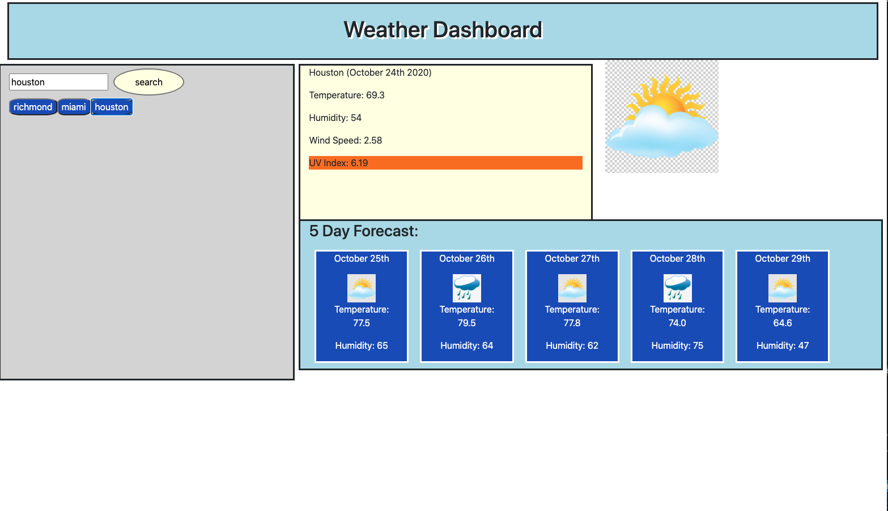

# homework-6

<h2> Weather Dashboard</h2> 

<h2> Author </h2>

Kendall Masterson

https://github.com/mastersonkl

masterson.kendall@gmail.com

<h2> Description </h2>

Simple user friendly weather dashboard. You type in a city into the search bar and a button with the city will populate under the search bar. Click on the button that appears and the 5 day forecast as well as todays forecast will populate to the right. The UV Index will be highlighted a different color depending on strength. You can search multiple cities and click back and forth from the buttons that are populated. The app can be found here: https://mastersonkl.github.io/homework-6/

